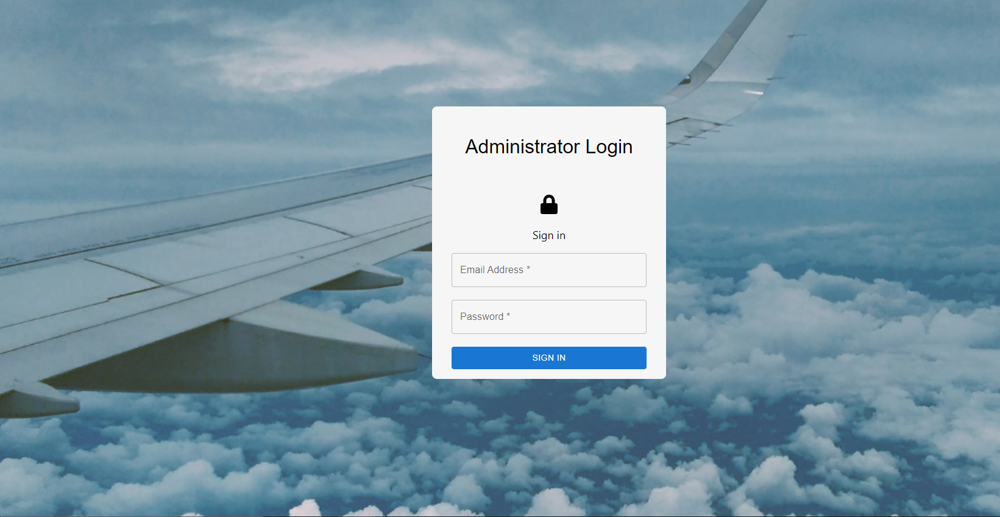
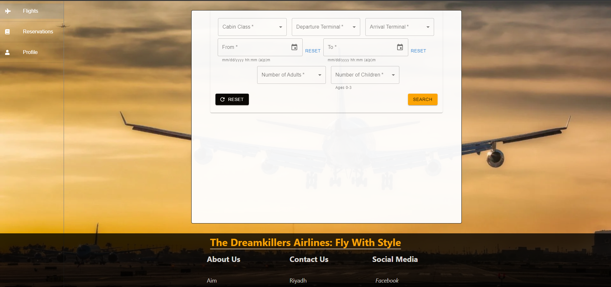

# **DreamKillers Airline System**
  In this project, we create a flight reservation system to facilitate flights booking and management. With 3 different user types, the system 
  encompasses different functionalities depending on the needs of each user. First, an Admin to manage the the entries in the system. Second, a Guest User 
  to browse through the system. Last, an Existing User to take action and reserve seats on the selected flights.
# **Motivation**
  The main intention behind this project is to hasten the flight reservation process. Instead of spending and effort time going to reservation office or face the trouble
  and confusion of navigating othe booking systems, we created this system with simplicity in mind. Rather than having the naunce of navigating through tedious menus to find
  the flight option best for you, our system allows you to do it with a simple search.
# **Build Status**
  This is a development build and the system is not yet deployed. This system might sometimes take a few extra seconds to process your request and it is perfectly normal

# **Code Style**
The main library used in the FrontEnd is react. Each component is in a folder that has its name along with a module.css flie 
standard node.js was used for the BackEnd with routers, modules, and main app all separated in appropriate folders. Throughout the project, camelCase was used to name all variables
and CamelCase was used to name components. The code was formatted with prettier and is displayed in its standard layout.

# **Screenshots**

# **Tech/Framework used**

we used the following :
1. we used Visual Studio Code as a text editor.
2. Node.js and Express were used for the backend server
3. mongodb was used to manage the database
4. npm was used to dowload packages
5. functional react was used for the frontend client along with jsx and some css styling
6. Chrome developers tool and postman was used for debugging

# **Features**
all users can login
After that, the features are divided into 2 categories depending on the type of the user
### *Admin*
  - An admin can create a flight and delete it
  - An admin can edit the flights on the system
  - An admin can search through the flights on the system with all possible parameters
### *User*
  - A user can search for flights with specific criteria
  ##### _Once the user logs in:_
  - The user can book both departure and return flights
  - The user can select the seat(s) he/she wants to book
  - The user can manage his/her reservations as in editing or deleting them
  - The user is updated by an email upon any reservation or cancellation
# **Code Examples**

# **Installation**
-Clone or download the zip file(dont forget to extract) of this project and then you have to download the dependancies
-For starters, you need to insall npm and node.
Then, all you have to do is go to both FrontEnd and BackEnd files through your terminal and write `npm install` and npm will download all the dependancies you need
-All you have left is to make your own .env file with the your api keys
# **API reference**
- Mongoose.js https://mongoosejs.com/
- Stipe.js https://stripe.com/docs/js
- NodeMailer https://nodemailer.com/about/
# **How to Use?**
##### After you completed the installation
- go to the FrontEnd folder in your terminal( cd PATH/DreamKillers/FrontEnd) and type `npm start` to startup the client
- go to the BackEnd folder in your terminal( cd PATH/DreamKillers/BackEnd) and type `node src/index.js` to startup the server
- Now you are free to use the system and enjoy all the features mentioned above
# **Contribute**
You can always email us with your ideas and suggestions at dkairlinesguc@gmail.com
# **License**
© DreamKillers, GUC
###### Licensed under the [MIT License](LICENSE)
